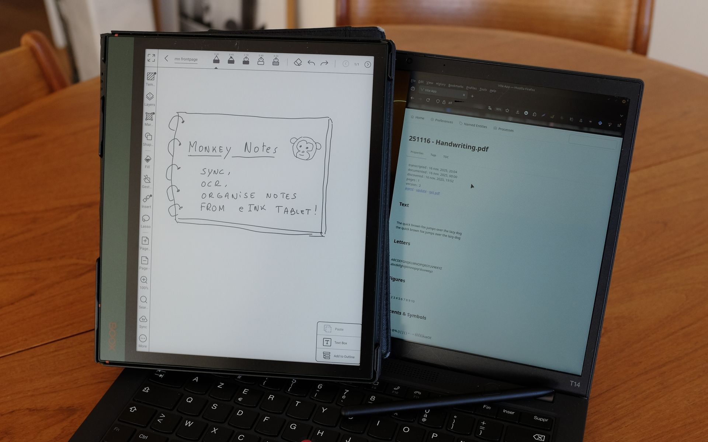
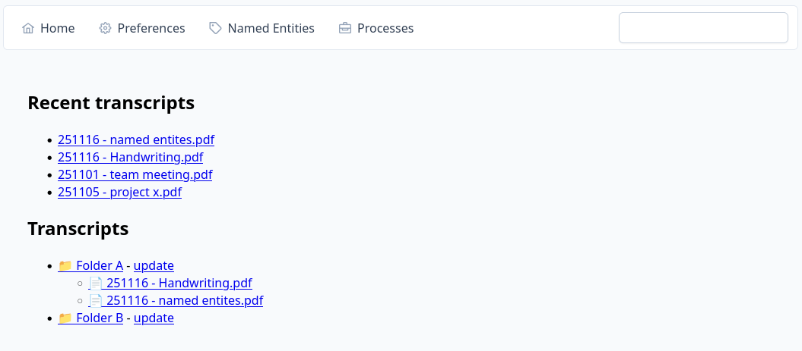
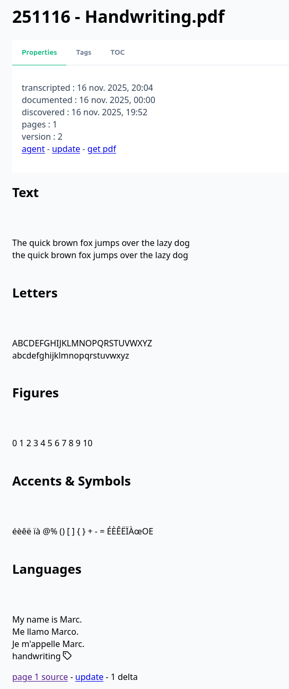
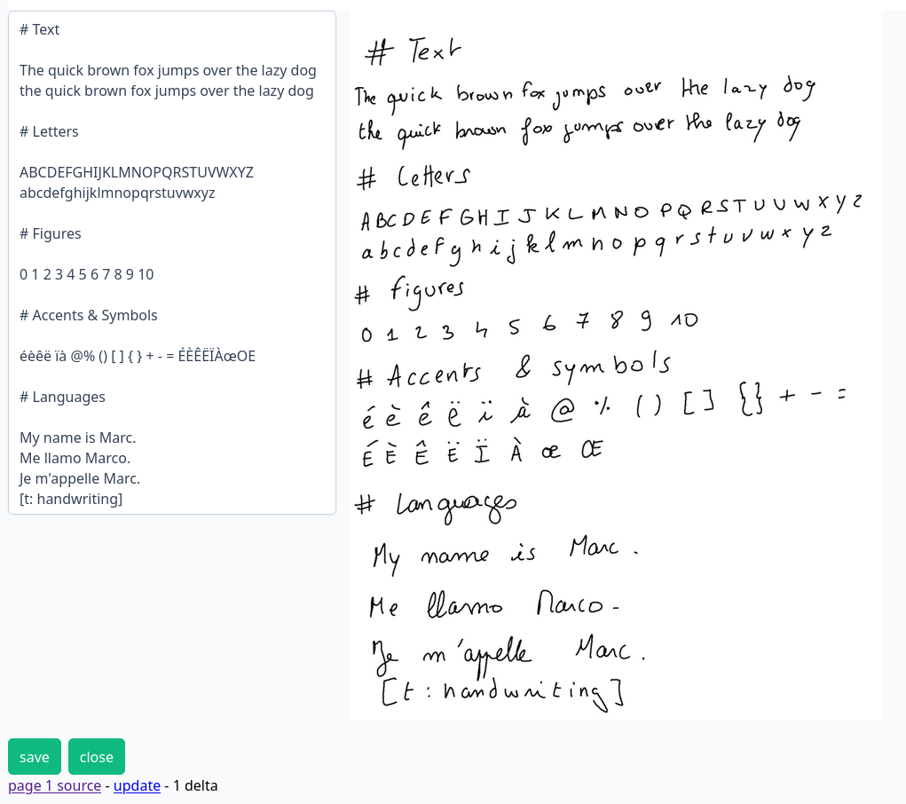
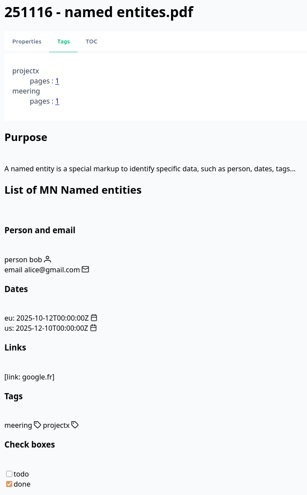
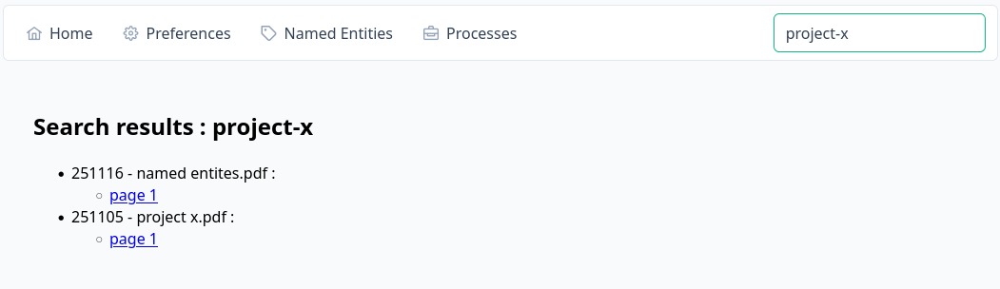

# MonkeyNotes

Use your eInk tablet notes to produce automatically high quality text using LLM's OCR !



# Features

## eInk tablet synchronisation

MonkeyNotes connects to your Google Drive to synchronise your notes automatically, based on PDF exports

Based on Google Drive API's, MonkeyNotes is notified for new or updated documents

* Download new notes and apply OCR
* Delta updates for page additions or page modification
* Manual update for folder, documents or pages

## AI Agent interaction

Interact with OpenAI ChatGPT for a single document or a whole folder.

Search over your notes, and interact with an AI Agent to retrieve specific data ("In which meeting we talked about Bob ?", "When does the project X was shipped ?")

## Named Entities

MonkeyNotes detects and stores :

* Markdown Titles : A ToC is created for each document `# Title 1`, `## Title 1.1`
* Tags : `[T:my-tag]`
* Email and persons : `[@:mike@gmail.com]`, `[p:bob]`
* EU and US dates : `[d:12/10/25]`, `[du:10/12/24]`
* Checkboxes : `[X:todo]`, `[V:done]`

## Lucene Search

Text and titles full search based on lucene 10.

# Quick tour

## Homepage

* Recent documents
* Folders view



## Transcript view

A transcription, result of OCR by Qwen LLM (https://huggingface.co/Qwen/collections).

Qwen 3 VL and Qwen OCR are powerful with manuscript transcription, in any language 

In this sample page, markdown titles (using #) are detected, stored, and rendered as html titles



## Edit mode

Each page is editable side by side with source picture

Each modification is stored as a delta to save space and keep history



## Named entities



## Search results

Lucene search results with links to document pages



# Technologies

* Spring Boot 3.3.5 and Java 21
* Vue.js 3.4 (using primevue components)
* Lucene search

## About the project

This is a very early version of the platform, the lack of polishing is obvious and there's plenty of bugs

I own an Boox Air Note 2 for a few years ; the device is good, the writing sensation is great.

But I was quickly disapointed by the lack of OCR features*

So I tried a few solutions, and it seems that today, LLM's have great results on OCRing handwrite text

Once transform to machine readable text, the notes could be organized, indexed, searched,... The ability to use an agent
to interact with your notes seems to me also quite powerful !

## About this version

I recently updated all the very basic UI to vue.js

Next, I worked on producing docker container, in order to provide an easy way to test the platform

## About Google Drive

Boox provide a basic sync system with Google Drive. Once you close a Note, a PDF is generated and sync to Google Drive.

Unfortunately, the Boox sync it seems a bit unstable... I'd like to upgrade this part for a more reliable sync.

To test the platform, the creation of a Google OAuth 2.0 ClientId is mandatory. Once this (painful) step done, MonkeyNotes
can browse your folders and download PDF to OCR them.

No upload, modification or deletion is implemented from MN to GoogleDrive.

But you may share a test folder to keep your notes safe from any harm !

# Dev env

* frontend will be served locally at : http://localhost:5173
* backend https://youtunnel.xyz tunnelized to http://localhost:8080

## ProgresSQL DB

todo

## HTTPS

Backend must be visible from outside. (mandatory to sync Google Drive)

Using an HTTPS tunnel such as `ngrok` or `pinggy` is a good idea.

Assuming backend is running on 8080, pinggy command : 

`ssh -p 443 -R0:localhost:8080 -L4300:localhost:4300 -o StrictHostKeyChecking=no -o ServerAliveInterval=30 XXXXXXX@pro.pinggy.io`

This will serve your local http backend server from your pinggy unique https URL such as `https://xxxxxxxx.a.pinggy.link`

## Spring Backend

Start Spring backend using JetBrains or `mvn spring-boot:run`

todo

## Serve UI using npm/vite

Use npm-docker scripts :

* run-build.sh : Create npm-ui container
* run-serve.sh : Serve UI using vite

# Docker install

## Prerequisites

* Docker and docker compose tools
* An https tunnel account like pinggy () or similar (ngrok...) - Https is mandatory for Google Auth 
* A Google console OAuth2.0 Web application client Id (https://console.cloud.google.com/auth/overview)
* A Qwen API key (OCR LLM)
* (optional) An OpenAI API key (Agent LLM to interact over the notes)

## Init docker-compose directory


In a new directory, copy the content of https://github.com/marc-p-b/monkey-notes/tree/main/docker/compose 

docker-compose.yml

## Edit nginx config

Open `data/nginx/app-run.conf` and replace `<<MY_DOMAIN>>` by your domain, like `https://mn.mydomain.com`

## Edit ui config

Open `data/nginx/env.js` and replace `<<MY_DOMAIN>>` by your domain. Keep the trailing `/api/`

## Edit backend config

Open `.env` and fill all the properties, assuming your are using `mn.mydomain.com`

```
YOUR_DOMAIN = https://mn.mydomain.com
YOUR_DOMAIN_API = https://mn.mydomain.com/api
CORS_DOMAINS = https://mn.mydomain.com
GDRIVE_CLIENT_ID = <<your google console client_id>>
GDRIVE_SECRET = <<your google console client_secret>>
OPENAI_API_KEY = <<your openai api key>>
QWEN_API_KEY = <<your openai api key>>
```

## Run MonkeyNotes App

Start the app using `docker compose up`

Watch the logs for admin password :

```
****** ----------------------- **************
****** Initializing admin user **************
password 25d9ccaa-efaf-4531-ae79-8aea7fd002bc
****** ----------------------- **************
```

## Connect Google Drive

From Preferences, connect to your Google Drive Account, and fill `Input Folder ID` with the folder id to synchronise.

Hit Save.

You main now force the first sync using `Update all folders and transcripts`

Wait for a full sync (watch Processes : `updateFolder folder ... (completed, ran for ...)`).

## Next startup

Edit `docker-compose.yml` and locate profiles setting :

replace `dist,init_admin`

by `dist,index_lucene`

Restart App

`docker compose stop && docker compose up`

Use your fqdn https://mn.mydomain.com to login using the admin user